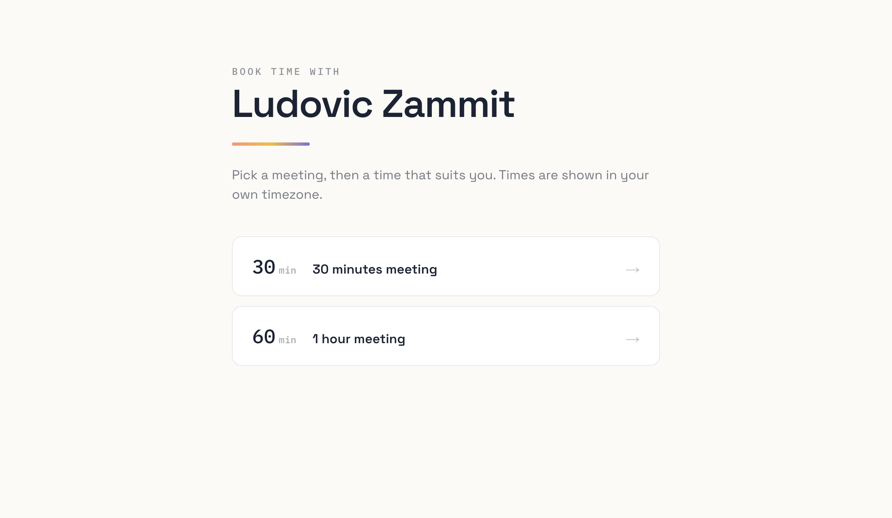

# Booking

A self-hosted, Calendly-style scheduling app. Share one link; people pick a time
that fits your real calendar; both sides get a proper calendar invite.

Built as a lightweight alternative to hosted schedulers: a single Next.js app, a
single SQLite file, and an optional macOS companion app that keeps your calendar
in sync — no external calendar API or third-party account required to get the
core value.

> **Signature idea — time of day as colour.** Every time slot is tinted along a
> circadian scale (dawn coral → noon gold → dusk violet) by its local hour, so a
> visitor scanning for "a morning slot" sees it before reading a single number.


<p align="center"><em>Picking a time — slots are tinted morning → midday → evening.</em></p>

---

## Features

- **Public booking pages** at `/book/<your-slug>` — a month calendar with
  timezone-aware slots shown in the *visitor's* timezone.
- **Multiple hosts** — each with their own login, availability, event types, and
  personalized booking URL.
- **Real availability** — slots are computed from your weekly hours minus your
  actual busy time (existing bookings + your calendar), respecting per-event
  duration, buffer, minimum notice, and how far ahead people can book.
- **Three ways your bookings reach your calendar** (use any or all):
  1. **Email invite** — inline `text/calendar` invitation that auto-surfaces in
     the recipient's calendar app.
  2. **macOS agent** — a menu-bar app that writes bookings straight into your
     local Calendar and pushes your busy times back up (privacy-preserving:
     only start/end times leave your Mac).
  3. **ICS subscription feed** — subscribe any calendar app to a secret URL.
- **Email confirmations** to guest and host with `.ics` attachments, via SMTP.
- **Cancellation** — self-service guest cancel links; freed slots reopen
  automatically.
- **Admin console** — manage users, roles, password resets, the signup
  invitation code, and email invitations.
- **Distinctive design** — a deliberate visual identity (see the signature idea
  above), theme-aware, accessible.

## Tech stack

| Layer | Choice |
|---|---|
| Web framework | Next.js (App Router) + React, TypeScript |
| Styling | Tailwind CSS |
| Database | SQLite via `better-sqlite3` (single file, WAL mode) |
| Auth / sessions | `iron-session` (encrypted cookie) + `bcryptjs` |
| Dates / timezones | `luxon` |
| Email | `nodemailer` (any SMTP provider) |
| Validation | `zod` |
| Companion app | Swift + EventKit (macOS menu-bar app) |
| Reverse proxy / TLS | Caddy (automatic HTTPS) |
| Process manager | systemd |

No paid services are required. Email needs any SMTP account; the macOS agent and
ICS feed need nothing external.

---

## Quick start (local)

Requires Node 20+ (developed on Node 22).

```bash
git clone <your-repo-url> booking && cd booking
npm install
cp .env.example .env        # then edit — SESSION_SECRET is required
npm run dev                  # http://localhost:3000
```

Minimum `.env` to boot:

```ini
SESSION_SECRET=<a random string of 32+ characters>
APP_URL=http://localhost:3000
```

Generate a secret with `openssl rand -hex 32`. See
[Configuration](#configuration) for the optional variables (SMTP, signup code,
Microsoft 365).

The database file is created automatically under `./data/` (override with
`DATA_DIR`). There are no migrations to run — the schema is created and migrated
in place on startup.

### Create the first account

1. Open `http://localhost:3000/signup`.
2. If `SIGNUP_CODE` is unset, signup is open; otherwise enter the code.
3. You now have a host account with sensible defaults (Mon–Fri 9–5, one 30-min
   event type). Make yourself an admin — see below.

### Become an admin

The first admin is set directly in the database:

```bash
sqlite3 data/booking.db "UPDATE hosts SET is_admin = 1 WHERE email = 'you@example.com';"
```

After that, an **Admin** tab appears in the dashboard and you can promote others
from the UI.

---

## Using the app

### As a host

- **Availability** — set your weekly hours (multiple windows per day) and your
  timezone.
- **Event types** — create meeting types (e.g. "30-minute intro"), each with its
  own duration, buffer, minimum notice, and booking window.
- **Your booking link** — pick a personalized slug (`/book/your-name`).
- **Settings** — connect your calendar (see below), grab your email-signature
  snippet, and view your API token / agent status.
- **Dashboard** — see upcoming and past bookings; cancel on behalf of a guest.

### Getting bookings onto your calendar

Pick whichever fits your setup — they're independent:

- **Email invites** work everywhere out of the box. Some corporate Exchange
  setups strip inline invitations; if that happens to you, use one of the next
  two.
- **macOS agent** — download the pre-configured app from **Settings → Local
  calendar agent**, open it, and grant Calendar access. It writes bookings into
  your Calendar and (optionally) pushes your existing busy times back so people
  can't double-book you. See [`mac-agent/`](mac-agent/).
- **ICS subscription** — copy the feed URL from Settings and add it in your
  calendar app ("Subscribe from web" / "New calendar subscription" / "From
  URL"). Works even where email invites don't.

### As a visitor (booking someone)

Open their link → pick a meeting type → the calendar opens on the first
available day → pick a time (colour tells you morning / midday / evening) → enter
name, company, and email → confirm. A confirmation email with a calendar invite
follows, including a link to cancel.



### As an admin

The **Admin** tab lists every account with live stats (event types, upcoming
bookings, agent status) and lets you:

- Invite users by email (sends a pre-filled signup link).
- Set or generate the signup invitation code (empty = open signup).
- Manage a separate **admin onboarding code** — signing up with it grants admin
  rights. It can be set, generated, and enabled/disabled independently (disable
  keeps the code but stops it working, so you can flip it on only while
  onboarding a new admin).
- Promote / demote admins, reset passwords, delete users (cascades their data).

---

## Configuration

All configuration is environment variables (`.env`). Only the first two are
required.

| Variable | Required | Purpose |
|---|:---:|---|
| `SESSION_SECRET` | yes | Encrypts the session cookie. 32+ characters. |
| `APP_URL` | yes | Public base URL. Drives links in emails, OAuth redirects, and secure-cookie behavior. |
| `DATA_DIR` | | Where `booking.db` lives (default `./data`). |
| `SIGNUP_CODE` | | Seeds the signup invitation code (afterwards managed in the admin UI). Empty = open signup. |
| `SMTP_HOST` / `SMTP_PORT` / `SMTP_USER` / `SMTP_PASS` / `SMTP_FROM` | | SMTP for confirmation and invitation emails. Without these, bookings still work; emails are skipped. |
| `MS_TENANT_ID` / `MS_CLIENT_ID` / `MS_CLIENT_SECRET` | | Optional Microsoft 365 (Graph) calendar sync. Superseded in practice by the macOS agent and ICS feed. |
| `AGENT_ZIP` | | Path to the prebuilt agent zip served from Settings (default `/opt/booking/agent/BookingAgent.app.zip`). |

See [`.env.example`](.env.example) for a copyable template.

---

## Deployment

A single small VM is plenty (developed on a 2-core / 4 GB Debian 12 host). The
outline:

1. Install Node 20+ and Caddy.
2. Clone the repo to `/opt/booking/app`, `npm install`, `npm run build`.
3. Create `.env` with `APP_URL` set to your `https://` domain (this also flips
   session cookies to Secure).
4. Run the app under systemd, bound to localhost (`npm start -- -H 127.0.0.1`).
5. Put Caddy in front for automatic HTTPS:

   ```caddyfile
   booking.example.com {
       reverse_proxy localhost:3000
   }
   ```

Point your domain's DNS at the VM first so Caddy can issue a certificate.
Detailed notes — including the systemd unit and the email/DNS setup — are in
[`docs/ARCHITECTURE.md`](docs/ARCHITECTURE.md#deployment).

---

## Repository layout

```
src/
  app/
    book/[slug]/…            Public booking pages + booking widget
    dashboard/…              Host dashboard (bookings, availability,
                             event-types, settings, admin)
    api/                     Route handlers (slots, book, busy, feed,
                             agent, resend-invites, ms oauth, agent download)
    login, signup, cancel    Auth + guest cancellation
  lib/
    db.ts                    SQLite schema + typed accessors
    slots.ts                 Availability / slot computation
    session.ts               iron-session helpers + auth guards
    actions.ts               Server actions (forms, admin)
    email.ts, ics.ts         Email + iCalendar building
    icsfeed.ts               ICS subscription feed
    msgraph.ts               Optional Microsoft 365 sync
mac-agent/                   Swift menu-bar companion app + build/install
docs/ARCHITECTURE.md         Architecture deep-dive
```

## Documentation

- **[Architecture](docs/ARCHITECTURE.md)** — components, data model, the
  availability algorithm, the three calendar-sync paths, and deployment.
- **[macOS agent](mac-agent/)** — the companion app and how it's packaged.

## License

[MIT](LICENSE) © Ludovic Zammit
