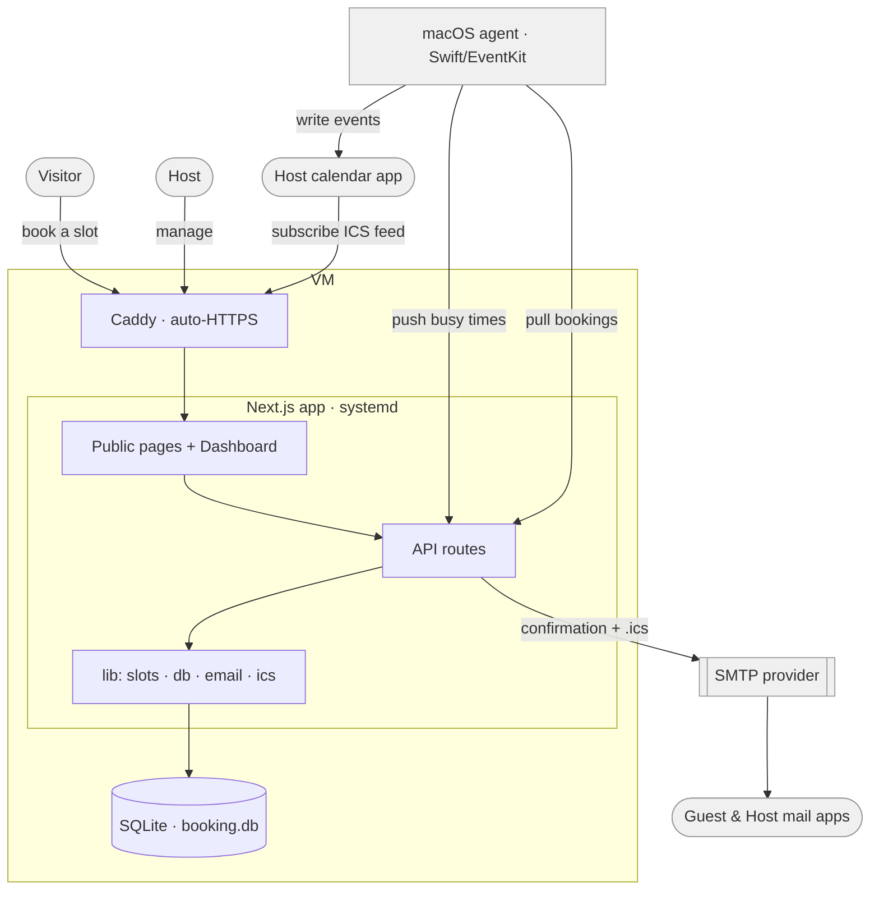

# Architecture

This document describes how Booking is put together: the components, the data
model, the availability algorithm, the three ways a booking reaches a host's
calendar, and how it's deployed.

## Overview

Booking is a single Next.js application backed by one SQLite file, fronted by
Caddy for TLS. An optional Swift menu-bar app on the host's Mac provides
two-way calendar sync. Email goes out over any SMTP provider.



## Components

### Web application (Next.js, App Router)

- **Public pages** (`src/app/book/[slug]/…`) — no auth. A host landing page
  lists active event types; each event type renders the booking widget (a
  client component that fetches slots and posts a booking).
- **Dashboard** (`src/app/dashboard/…`) — auth-gated. Bookings list, availability
  editor, event-type editor, settings, and the admin console. The dashboard
  layout enforces `requireHost()`; the admin page enforces `requireAdmin()`.
- **API routes** (`src/app/api/…`) — see [API surface](#api-surface).
- **Server actions** (`src/lib/actions.ts`) — form submissions (signup, login,
  availability, event types, slug, admin operations) run as server actions
  rather than API routes.

Rendering is server-first; only genuinely interactive pieces (the booking
widget, the availability rules editor, the signature card) are client
components.

### Database (SQLite)

One file, opened with `better-sqlite3` in WAL mode with foreign keys on. A
single connection is reused across dev-mode module reloads. The schema is
created with `CREATE TABLE IF NOT EXISTS` and evolved with idempotent
`ALTER TABLE` guards at startup — there is no separate migration tool. See
[Data model](#data-model).

### macOS agent (Swift + EventKit)

A menu-bar app (`mac-agent/`) that runs a sync every five minutes:

1. **Pushes busy times up** — reads the next ~60 days from the Mac's calendars
   and posts *only start/end intervals* (no titles, attendees, or locations) to
   `POST /api/busy`. Optionally also fetches a published Outlook ICS feed and
   pushes those intervals as a second source.
2. **Pulls bookings down** — `GET /api/agent/bookings` and reconciles them into
   the local Calendar via EventKit (create / update / remove). Agent-created
   events are tracked in a local `events.json` map (booking id → EKEvent
   identifier), so event notes stay clean.

It authenticates with the host's API token (Bearer). Config lives at
`~/Library/Application Support/BookingAgent/config.json`; a personalized build
downloaded from Settings ships a sidecar `booking-config.json` it imports on
first launch.

### Email (SMTP via nodemailer)

Confirmation, cancellation, and invitation emails. Calendar invitations are
delivered as an **inline `text/calendar` part** rather than a file attachment —
this is what makes them auto-surface as meeting requests in Exchange / Apple
Mail (see [Calendar sync paths](#calendar-sync-paths)). All email is
best-effort: if SMTP is unconfigured or fails, the booking still succeeds.

### Caddy + systemd

Caddy terminates TLS (automatic Let's Encrypt) and reverse-proxies to the app on
localhost. The Next.js app runs as a systemd service bound to `127.0.0.1`, so
the only public port is Caddy's 443.

## Data model

Eight tables (`src/lib/db.ts`). Foreign keys cascade on host deletion.

| Table | Purpose | Key columns |
|---|---|---|
| `hosts` | Accounts | `email`, `name`, `slug`, `password_hash`, `timezone`, `api_token`, `is_admin` |
| `event_types` | Meeting types per host | `duration_min`, `buffer_min`, `min_notice_min`, `window_days`, `active` |
| `availability_rules` | Weekly hours | `weekday` (1–7), `start_min`, `end_min` (minutes from midnight, host tz) |
| `bookings` | The bookings | `guest_name`, `guest_email`, `guest_company`, `guest_timezone`, `start_utc`, `end_utc`, `status`, `cancel_token`, `ms_event_id` |
| `ms_tokens` | Microsoft 365 OAuth tokens | per host, refresh handled lazily |
| `webex_tokens` | Webex OAuth tokens | per host, refresh handled lazily |
| `external_busy` | Busy intervals pushed by agents | `source`, `start_utc`, `end_utc` |
| `agent_syncs` | Agent heartbeat | `source`, `last_sync`, `blocks` (drives the "Connected/Offline" badge) |
| `settings` | Key/value app settings | `signup_code`, `admin_code`, `admin_code_enabled` |

Times are stored in UTC (ISO 8601). Availability rules are stored in the host's
local minutes-from-midnight and resolved against the host timezone at
computation time, so DST is handled by luxon rather than by stored offsets.

## Availability algorithm

`src/lib/slots.ts` computes bookable slots for an event type over a date range:

1. **Candidate slots** — for each day in range, apply that weekday's
   availability rules, stepping by the event duration from each window's start.
2. **Constraints** — drop slots earlier than *now + minimum notice* or later
   than *now + booking window*.
3. **Busy subtraction** — remove any candidate that overlaps (padded by the
   event's buffer on both sides) with:
   - confirmed bookings for that host,
   - `external_busy` intervals (pushed by the macOS agent),
   - Microsoft 365 busy intervals (if the host connected M365).
4. All comparisons happen in UTC; display timezones are applied only at the
   edges (host tz for storage/rules, visitor tz in the browser).

Booking is re-validated server-side at commit time (`isSlotFree`) to close the
race between rendering slots and submitting, so two people can't grab the same
slot.

## Calendar sync paths

Getting a booking onto a host's calendar is the one genuinely tricky part,
because corporate mail systems vary. Booking offers three independent
mechanisms; a host can use any combination.

| Path | How it works | Best when |
|---|---|---|
| **Inline email invite** | Confirmation email carries the invitation as an inline `text/calendar; method=REQUEST` part (not an attachment), so the mail app treats it as a meeting request. | Gmail, Apple Mail, most setups. |
| **macOS agent** | Menu-bar app pulls bookings and writes them into the local Calendar via EventKit. | Any Mac host, especially where email invites are stripped. |
| **ICS subscription feed** | `GET /api/feed/[token]` publishes the host's bookings as a live iCalendar the host subscribes to from any calendar app. Cancelled bookings drop out on refresh. | Any client; zero install; survives strict Exchange. |

> **Why inline, not an attachment?** A/B testing against Exchange + Apple Mail
> showed that shipping the `.ics` as a *file attachment* renders a dead file the
> user must open manually, while a single *inline* `text/calendar` part (with a
> `Content-Class: urn:content-classes:calendarmessage` header) auto-surfaces the
> meeting — matching how Webex/Outlook invitations behave.

The ICS feed and agent-pull authenticate differently on purpose:

- **Agent** uses a Bearer API token (it can set headers).
- **ICS feed** uses a secret token *in the URL*, because calendar subscription
  clients can't send custom headers — the same trust model as Google Calendar's
  private iCal address.

## API surface

| Route | Auth | Purpose |
|---|---|---|
| `GET /api/slots` | none | Available slots for an event type over a date range. |
| `POST /api/book` | none | Create a booking (re-validates availability, schedules an optional Webex meeting, sends emails, optional M365 event). |
| `GET /api/webex/connect`, `GET /api/webex/callback` | session | Webex OAuth flow (optional). |
| `GET /api/feed/[token]` | URL token | Host's bookings as a subscribable ICS calendar. |
| `POST /api/busy` | Bearer (api_token) | Agent pushes busy intervals + heartbeat. |
| `GET /api/agent/bookings` | Bearer (api_token) | Agent pulls bookings to reconcile locally. |
| `GET /api/agent/download` | session or `?token=` | Streams the prebuilt agent zip with a personalized config sidecar. |
| `POST /api/resend-invites` | Bearer (api_token) | Re-send confirmations for a host's upcoming bookings. |
| `GET /api/ms/connect`, `GET /api/ms/callback` | session | Microsoft 365 OAuth flow (optional). |

Server actions (not REST) handle signup, login, logout, availability, event
types, slug, and all admin operations.

## Security model

- **Passwords** hashed with bcrypt; sessions are encrypted cookies
  (`iron-session`), Secure when `APP_URL` is `https://`.
- **Host API token** — a per-host secret used by the agent and resend endpoints.
- **ICS feed token** — a per-host URL secret; treat the feed URL as sensitive.
- **Cancellation token** — a per-booking unguessable token in the cancel link.
- **Admin actions** re-check `requireAdmin()` server-side (not just hidden in the
  UI); admins can't demote or delete themselves.
- **Signup** is gated by an invitation code when set (managed in the admin UI,
  seeded from `SIGNUP_CODE`).
- **Admin onboarding code** — a separate secret (settings key `admin_code`);
  signing up with it grants admin. It has an independent enable/disable flag
  (`admin_code_enabled`) so it can be kept but switched off between onboardings.
  Signup honors it only when enabled; the admin code always suffices on its own,
  otherwise the regular signup code is enforced.
- The app process binds to localhost; only Caddy is exposed.

## Deployment

Reference setup (single Debian VM):

**1. System packages** — Node 20+ and Caddy.

**2. App** — clone to `/opt/booking/app`, then:

```bash
npm install
npm run build
```

**3. Environment** — `/opt/booking/app/.env`:

```ini
SESSION_SECRET=<openssl rand -hex 32>
APP_URL=https://booking.example.com
DATA_DIR=/opt/booking/data
# SMTP_* for email; SIGNUP_CODE to gate signup
```

**4. systemd unit** — `/etc/systemd/system/booking.service`:

```ini
[Unit]
Description=Booking app
After=network.target

[Service]
Type=simple
User=booking
WorkingDirectory=/opt/booking/app
ExecStart=/usr/bin/npm start -- -H 127.0.0.1
Restart=always
Environment=NODE_ENV=production
Environment=PORT=3000

[Install]
WantedBy=multi-user.target
```

```bash
systemctl daemon-reload && systemctl enable --now booking
```

**5. Caddy** — `/etc/caddy/Caddyfile`:

```caddyfile
booking.example.com {
    reverse_proxy localhost:3000
}
```

Point the domain's DNS at the VM before starting Caddy so it can issue the
certificate.

**Email (optional but recommended).** Any SMTP provider works. If you use a
transactional provider (e.g. Resend, Mailgun, SES) with a custom From domain,
verify the domain and add the DKIM/SPF (and optionally DMARC) DNS records the
provider gives you, then set `SMTP_*` accordingly. Deliverability to strict
corporate inboxes depends on these records.

**Updating.** Rebuild in place and restart:

```bash
npm run build && systemctl restart booking
```

The database migrates itself on startup; no separate migration step.

### macOS agent packaging

The agent is built and packaged from `mac-agent/` (`build.sh` compiles the
`.app`; `install.sh` installs it locally). The server serves a prebuilt zip
from `AGENT_ZIP` (default `/opt/booking/agent/BookingAgent.app.zip`) via
`/api/agent/download`, injecting a per-host config sidecar so a downloaded copy
is ready to run. Because the app is signed with a local/ad-hoc certificate,
first launch on a managed Mac may require clearing the quarantine attribute
(`xattr -dr com.apple.quarantine <app>`) — an Apple Developer ID + notarization
removes that step.
